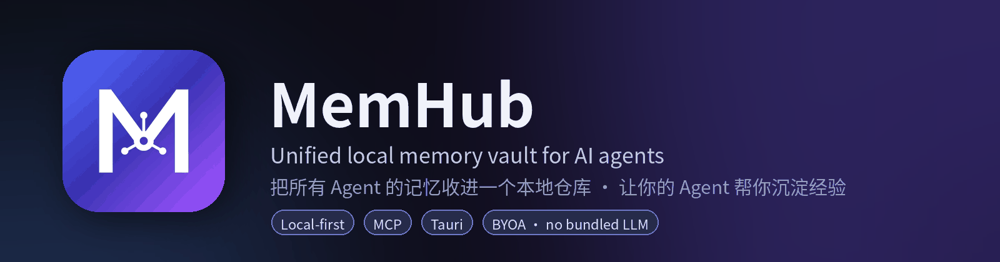
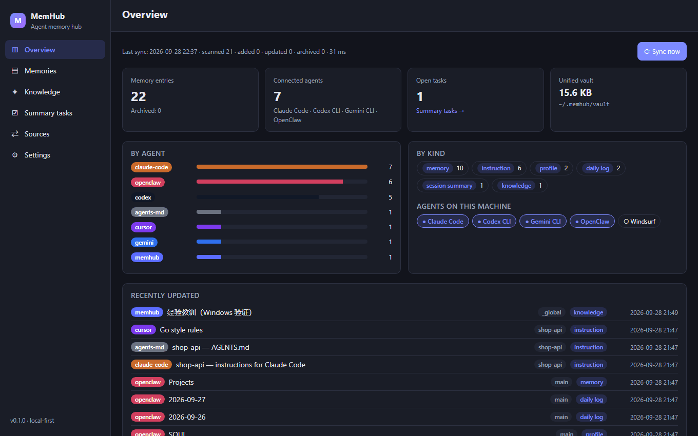
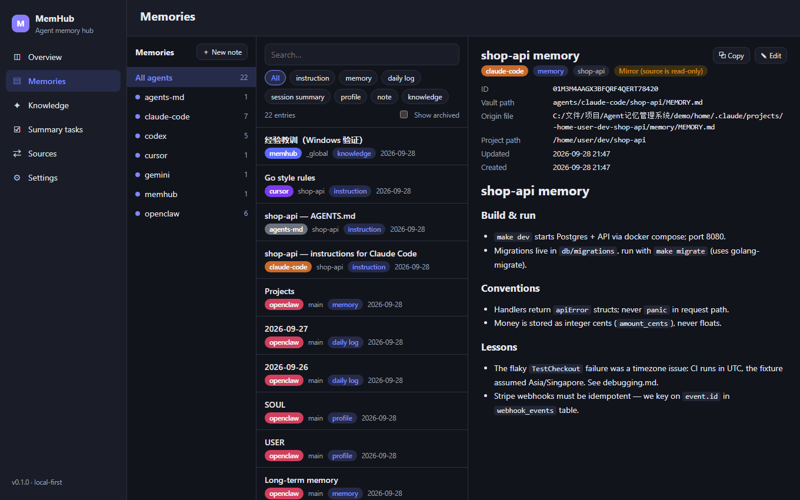
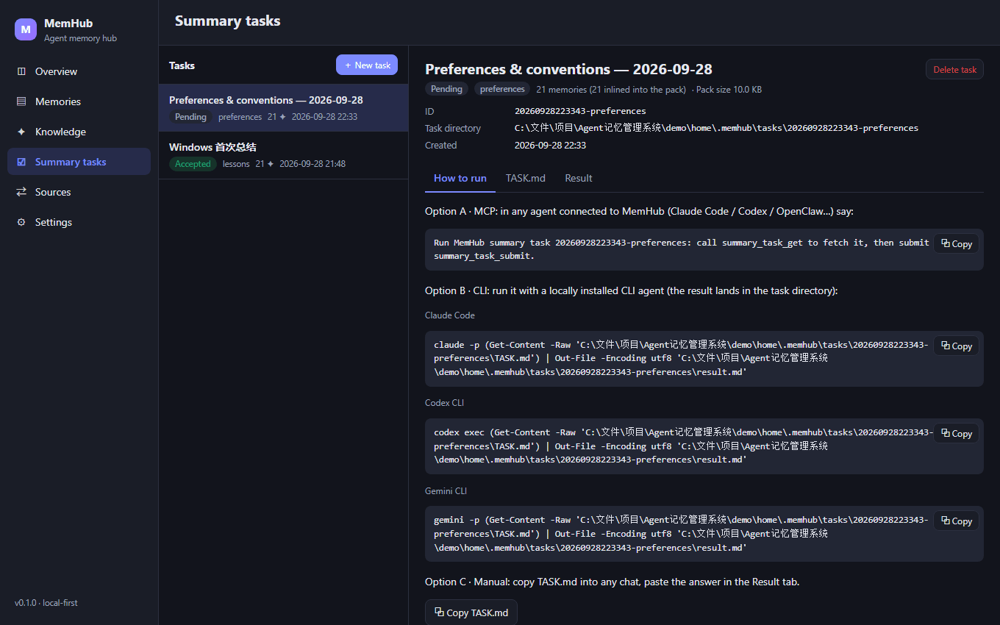
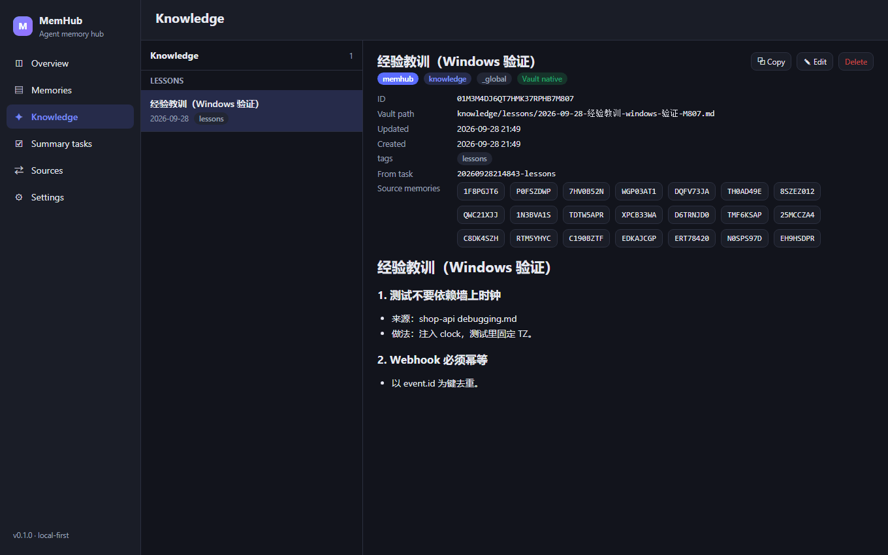
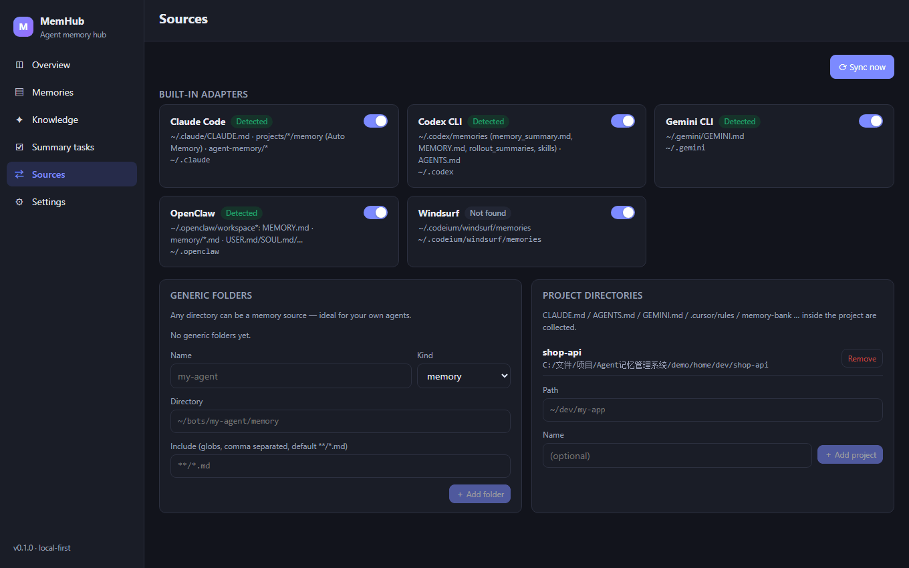
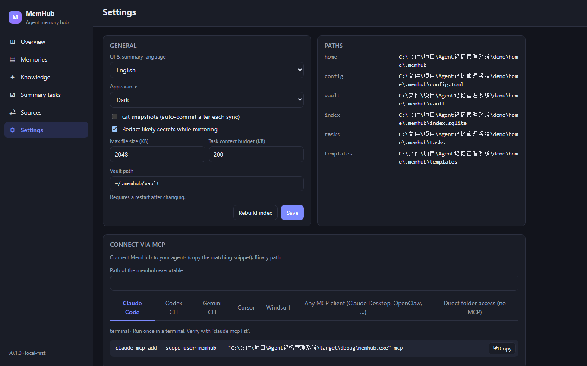
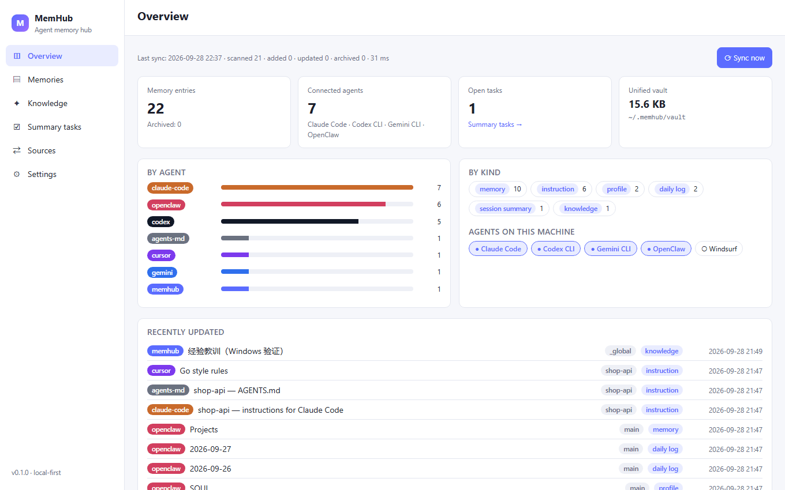
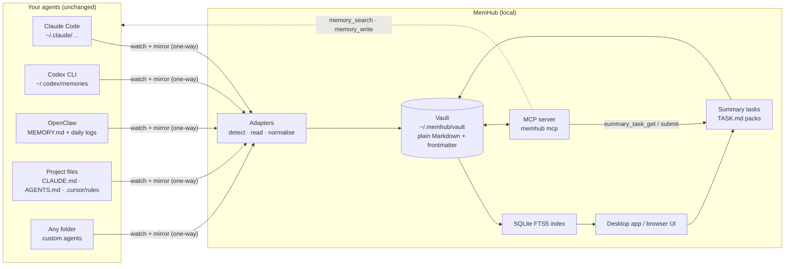

<p align="center">
  
</p>

<p align="center">
  <a href="https://github.com/MT-gar/MemHub/actions/workflows/ci.yml"></a>
  <a href="https://github.com/MT-gar/MemHub/releases"></a>
  <a href="LICENSE"></a>
  
  
  
</p>

<p align="center">
  <b>English</b> · <a href="README.zh-CN.md">简体中文</a> · <a href="docs/DESIGN.md">Design doc (zh)</a> · <a href="CHANGELOG.md">Changelog</a>
</p>

---

Every AI coding agent keeps its own notebook: Claude Code writes `CLAUDE.md` and auto-memory files, Codex CLI keeps `~/.codex/memories/`, OpenClaw has `MEMORY.md` plus daily logs, Cursor has `.cursor/rules`, and your home-grown agents have whatever you gave them. None of them can read the others.

**MemHub** finds those files, mirrors them **one-way into a single, plain-Markdown vault on your disk**, gives you a desktop app to browse / search / edit them, exposes the vault to every agent over **MCP**, and turns *"summarise what my agents have learned"* into a task that **your existing agents** execute — no API key, no bundled LLM, nothing leaves your machine.

<p align="center">
  
</p>

## Table of contents

- [Highlights](#highlights)
- [Screenshots](#screenshots)
- [How it works](#how-it-works)
- [Supported agents](#supported-agents)
- [Install](#install)
- [Quick start](#quick-start)
- [Connect your agents (MCP)](#connect-your-agents-mcp)
- [Summaries: bring your own agent](#summaries-bring-your-own-agent)
- [Vault layout](#vault-layout)
- [CLI & configuration](#cli--configuration)
- [Privacy & security](#privacy--security)
- [Development](#development)
- [Roadmap](#roadmap)
- [License](#license)

## Highlights

| | |
|---|---|
| 🔍 **Auto-discovery + one-way mirror** | Detects installed agents, mirrors their memory files incrementally (content hashes), archives entries whose source disappeared, optional git snapshots for history. Source files are never modified. |
| 🧩 **Built-in adapters** | Claude Code, Codex CLI, Gemini CLI, OpenClaw, Windsurf, project-level files (`CLAUDE.md`, `AGENTS.md`, `GEMINI.md`, `.cursor/rules`, Cline `memory-bank/`, Copilot instructions, Kiro steering) — and **any folder** for custom agents. |
| 🖥️ **Desktop app (Tauri 2)** | Overview, three-pane memory browser with full-text search (SQLite FTS5 trigram — CJK-friendly), knowledge notes, summary tasks, sources, settings. English / 中文, light / dark. |
| 🔌 **MCP server** | `memhub mcp` exposes `memory_search`, `memory_read`, `memory_list`, `memory_write`, `knowledge_save`, `summary_task_get`, `summary_task_submit`. Agents share one memory. |
| 🧠 **BYOA summaries** | Pick a scope + template (lessons · preferences · project brief · dedupe · digest) → MemHub builds a task pack → run it with MCP, one CLI line or copy-paste → review → accept as a knowledge note with source traceability. |
| 🔒 **Private by default** | 100 % local. Secret-looking strings are redacted while mirroring. Vault folder is created `0700`. No telemetry. |
| 🌐 **Browser mode** | `memhub serve` runs the same UI over HTTP for servers, NAS boxes or headless setups. |

## Screenshots

<table>
  <tr>
    <td width="50%"><p align="center"><sub><b>Memories</b> — agents on the left, full-text search in the middle, rendered Markdown on the right</sub></p></td>
    <td width="50%"><p align="center"><sub><b>Summary tasks</b> — three ways to run a task with the agent you already have</sub></p></td>
  </tr>
  <tr>
    <td><p align="center"><sub><b>Knowledge</b> — accepted summaries with links back to the memories they came from</sub></p></td>
    <td><p align="center"><sub><b>Sources</b> — built-in adapters, generic folders and project directories</sub></p></td>
  </tr>
  <tr>
    <td><p align="center"><sub><b>Settings</b> — copy-ready MCP snippets for each agent</sub></p></td>
    <td><p align="center"><sub><b>Light theme</b> — follows the system or pick one</sub></p></td>
  </tr>
</table>

## How it works



1. **Mirror** — adapters read each agent's files and write one Markdown file per entry into the vault, with a small YAML front matter (`id`, `agent`, `source`, `origin`, `project`, `kind`, `title`, `created`, `updated`, `origin_hash`, `tags`, …). A file watcher keeps the mirror fresh; a full re-scan runs periodically.
2. **Index** — everything goes into a local SQLite FTS5 index (trigram tokenizer, so Chinese/Japanese and code identifiers search well). Delete the index any time; it is a cache.
3. **Share** — `memhub mcp` gives any MCP-capable agent search/read/write access to the vault. Agents that do not speak MCP can simply read the folder.
4. **Distil** — you create a *summary task*; MemHub inlines the selected memories into `TASK.md`; **your** agent produces the summary; you review and accept it as a knowledge note.

## Supported agents

| Agent | What is collected | Where |
|---|---|---|
| **Claude Code** | Global & project `CLAUDE.md`, auto-memory (`MEMORY.md` + topic files), sub-agent memory, project path recovered from session `cwd` | `~/.claude/…`, `<repo>/.claude/…` |
| **Codex CLI** | `memory_summary.md`, `MEMORY.md`, rollout summaries, skills, `AGENTS.md` | `~/.codex/memories/`, `~/.codex/AGENTS.md` |
| **Gemini CLI** | Global & project `GEMINI.md` | `~/.gemini/`, `<repo>/GEMINI.md` |
| **OpenClaw** | `MEMORY.md`, daily logs `memory/YYYY-MM-DD.md`, evergreen notes, `SOUL.md` / `USER.md` profiles — every workspace | `~/.openclaw/workspace*/` |
| **Windsurf** | Cascade memories | `~/.codeium/windsurf/memories/` |
| **Project files** | `AGENTS.md`, `.cursorrules` / `.cursor/rules/*.mdc`, Cline `memory-bank/*.md`, `.github/copilot-instructions.md`, `.windsurfrules`, `.kiro/steering/*.md` | any project directory you register |
| **Generic folder** | Any Markdown/text files matching your globs | any path — perfect for home-grown agents |
| **Native notes** | Written by agents through MCP (`memory_write`) or by you in the app | `vault/inbox/` |

Missing your agent? Adapters are ~100 lines of Rust — see [CONTRIBUTING.md](CONTRIBUTING.md).

## Install

**Desktop app** — download the latest bundle from [Releases](https://github.com/MT-gar/MemHub/releases): `.msi` / `-setup.exe` (Windows), `.dmg` (macOS), `.AppImage` / `.deb` / `.rpm` (Linux). The CLI is bundled inside the app as a sidecar.

> macOS builds are not notarised yet: right-click → *Open* on first launch.

**Standalone CLI** — `memhub-cli-<target>.zip|tar.gz` from the same release page; put `memhub` on your `PATH`.

**From source** (Rust stable, Node 20+):

```bash
git clone https://github.com/MT-gar/MemHub.git && cd MemHub

# CLI + browser mode
npm ci --prefix ui && npm run build --prefix ui
cargo build --release -p memhub-cli
./target/release/memhub serve            # → http://127.0.0.1:7337

# Desktop app (needs the Tauri prerequisites: https://tauri.app/start/prerequisites/)
./scripts/build-sidecar.sh               # bundles the CLI as a sidecar
npm ci --prefix apps/desktop && npm run build --prefix apps/desktop
# → apps/desktop/src-tauri/target/release/bundle/
```

> **Windows**: use the MSVC toolchain (`rustup default stable-msvc`, or `rustup override set stable-x86_64-pc-windows-msvc` inside the repo). The GNU toolchain fails on `windows-sys` unless MinGW's `dlltool` is installed. The `scripts/*.sh` helpers run fine under Git Bash. A full Windows walkthrough is in [docs/mcp-memhub-bootstrap.md](docs/mcp-memhub-bootstrap.md).

## Quick start

```bash
memhub detect        # which agents are installed on this machine (read-only)
memhub scan          # first mirror into ~/.memhub/vault
memhub serve         # open http://127.0.0.1:7337 — or just launch the desktop app
```

The desktop app does the same on launch and keeps watching in the background. Open **Sources** to enable/disable adapters, add a generic folder or register a project directory; **Overview** shows what was found.

Want to try it without touching your real data? `./scripts/demo.sh` builds a fake home with memories from several agents:

```bash
./scripts/demo.sh
export MEMHUB_USER_HOME="$PWD/demo/home" MEMHUB_HOME="$PWD/demo/home/.memhub"
memhub serve
```

## Connect your agents (MCP)

**Settings → Connect via MCP** generates copy-ready snippets with the right binary path. The essentials:

```bash
claude mcp add --scope user memhub -- memhub mcp        # Claude Code
codex mcp add memhub -- memhub mcp                      # Codex CLI
gemini mcp add memhub memhub mcp                        # Gemini CLI
```

Any other MCP client (Cursor, Windsurf, Claude Desktop, OpenClaw, …):

```json
{ "mcpServers": { "memhub": { "command": "memhub", "args": ["mcp"] } } }
```

| Tool | Purpose |
|---|---|
| `memory_search(query, limit?, agent?, project?, kind?)` | Full-text search across all agents' memories, shared notes and knowledge |
| `memory_read(id)` | Full content of one entry |
| `memory_list(agent?, project?, kind?, since?, limit?)` | Recent entries, filtered |
| `memory_write(title, content, tags?, project?, agent?)` | Save a note to `vault/inbox` so other agents can find it |
| `knowledge_save(title, content, tags?, sources?)` | Save a distilled knowledge note |
| `summary_task_get(task_id?)` | Fetch a summary task (the full prompt + memories) |
| `summary_task_submit(task_id, result)` | Return the summary for review in the app |

Agents without MCP support can read the vault directly — paste the *"Direct folder access"* snippet from Settings into their `AGENTS.md` / `CLAUDE.md`.

## Summaries: bring your own agent

MemHub deliberately ships **no LLM and needs no API key**. Instead it prepares the work so that whichever agent you already pay for can do it:

1. **Summary tasks → New task**: choose a template and a scope (agents, projects, kinds, keyword, time window). MemHub writes `~/.memhub/tasks/<id>/TASK.md` with the instructions and the selected memories inlined (entries beyond the context budget are listed by id — the agent can fetch them with `memory_read`).
2. **Run it** with the agent of your choice:
   - *MCP*: in any connected agent say *"Run MemHub summary task `<id>`"* → it calls `summary_task_get` … `summary_task_submit`;
   - *CLI*: `claude -p "$(cat TASK.md)" > result.md` (or `codex exec …` / `gemini -p …`; the app shows PowerShell equivalents on Windows);
   - *Manual*: paste `TASK.md` into any chat window and paste the answer back into the **Result** tab.
3. **Review → Accept**: the result becomes `vault/knowledge/<template>/<date>-<title>.md` with `sources: [ids]` in its front matter, and `knowledge/INDEX.md` is rebuilt. Agents can read it through MCP or straight from the folder.

Built-in templates (editable Markdown in `~/.memhub/templates/`):

| Template | Produces |
|---|---|
| `lessons` | Reusable lessons distilled from debugging notes, mistakes and things that worked |
| `preferences` | Your stable preferences, coding conventions and no-gos across all agents |
| `project-brief` | One knowledge card per project: architecture, decisions, conventions, commands, open issues |
| `dedupe` | Duplicated, stale or contradicting memories across agents, with proposed merges |
| `digest` | What each agent worked on and learned in a period; pending items |

## Vault layout

```
~/.memhub/                       (override with MEMHUB_HOME)
├── config.toml                  sources, projects, options
├── index.sqlite                 full-text index (a cache — safe to delete)
├── templates/                   summary templates (Markdown, yours to edit)
├── tasks/<id>/                  TASK.md · task.json · result.md
└── vault/                       ★ the unified memory folder (git-initialised when git is available)
    ├── agents/<agent>/<project>/…   read-only mirrors
    ├── inbox/<agent>/…              notes written via MCP / the app
    └── knowledge/<template>/…       accepted summaries + INDEX.md
```

Every entry is Markdown with a short YAML front matter, so the vault stays useful with any editor, Obsidian, `grep`, or git — with or without MemHub.

## CLI & configuration

```
memhub scan                       mirror once
memhub watch                      mirror, then keep watching
memhub mcp [--agent NAME]         stdio MCP server
memhub serve [--host H] [--port 7337] [--no-watch] [--allow-origin O] [--token T]
                                  web UI + HTTP API (POST /api/<command>)
memhub detect | list | search <q> | show <id> | paths | reindex
memhub --home <dir> …             use another MemHub home
```

`~/.memhub/config.toml`:

```toml
vault = "~/.memhub/vault"
language = "en"                  # UI + summary language ("zh-CN" | "en")
git_snapshot = false             # commit the vault after each sync
max_file_size_kb = 2048
redact_secrets = true
task_context_budget_kb = 200

[[sources]]
type = "claude-code"             # claude-code | codex | gemini | openclaw | windsurf | generic
enabled = true

[[sources]]
type = "generic"                 # any folder — e.g. your own agent
name = "my-agent"
root = "~/my-agent/memory"
include = ["**/*.md"]
kind = "memory"

[[projects]]
path = "~/dev/shop-api"          # CLAUDE.md / AGENTS.md / .cursor/rules / memory-bank … inside it
name = "shop-api"
```

Environment: `MEMHUB_HOME` relocates everything; `MEMHUB_USER_HOME` changes the home directory the adapters scan (defaults to the OS home — note that Windows ignores `HOME`).

## Privacy & security

- **Local only.** No telemetry, no bundled model. Browser mode binds to `127.0.0.1` by default and rejects requests from other websites (Host / Origin / content-type checks, so neither cross-site posts nor DNS rebinding can drive it).
- **Exposing browser mode is opt-in and token-protected.** With `--host 0.0.0.0` (or any non-loopback address, or `--token`) MemHub generates an access token and prints a `…/?token=…` link; without the token every request except `/api/health` gets 401. Use a reverse proxy with TLS if the network is not trusted.
- **Read-only towards your agents.** MemHub never edits the source files; edits you make to a mirrored entry are overwritten on the next change of the source (the app warns you).
- **Secret redaction** replaces API-key-looking strings (`sk-…`, `ghp_…`, `AKIA…`, private keys, `password=…`, …) with `[REDACTED]` while mirroring. Best effort — review task packs before sending them to a hosted model.
- **You decide what leaves the machine**: summaries only go to the agent *you* run them with.

See [SECURITY.md](SECURITY.md) for reporting issues.

## Development

```
crates/memhub-core   Rust core: adapters, vault, index, tasks, MCP, watcher, API dispatch
crates/memhub-cli    the `memhub` binary (also the desktop sidecar)
ui/                  React + Vite front end shared by desktop and browser mode
apps/desktop         Tauri 2 shell (thin: one `rpc` command → core)
docs/                design doc, Windows notes, screenshots
scripts/             demo data, dev loop, sidecar build
```

```bash
./scripts/demo.sh                 # fake home with memories from several agents
./scripts/dev.sh                  # API on :7337 (demo data) + Vite HMR on :1420
cargo test --workspace
npm run dev --prefix apps/desktop # desktop window with hot reload
```

CI builds and tests on Ubuntu, Windows and macOS and type-checks the Tauri shell; tags `v*` build desktop bundles for Windows, macOS (arm64 + x64) and Linux plus standalone CLI archives and attach them to a draft GitHub Release. Contributions welcome — see [CONTRIBUTING.md](CONTRIBUTING.md).

## Roadmap

- Pull-based rules for agents: approved preferences served through MCP (`rules_get`) and `memhub context`, then opt-in write-back (see [docs/mcp-next-steps.md](docs/mcp-next-steps.md))
- Codex memories stored in SQLite (`memories_1.sqlite`, newer Codex versions)
- Session transcript summaries (Claude Code / Codex `.jsonl` → per-session recap)
- Write-back with diff preview (vault → agent files, opt-in)
- Dedupe / conflict view across agents
- More adapters (Cline global memory, Aider, Continue, Roo Code, …)
- Auto-update for the desktop app

Details and the M0 status table live in [docs/DESIGN.md](docs/DESIGN.md).

## License

[MIT](LICENSE) © 2026 MT-gar and MemHub contributors
