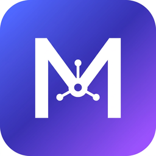

<p align="center">
  
</p>
<h1 align="center">MemHub</h1>
<p align="center"><b>One local vault for the memories of all your AI agents.</b><br/>
Claude Code · Codex CLI · Gemini CLI · OpenClaw · Cursor · Windsurf · your own agents</p>
<p align="center"><a href="README.zh-CN.md">中文说明</a> · <a href="docs/DESIGN.md">Design doc</a></p>

---

Every agent keeps its own notebook — `CLAUDE.md`, `~/.claude/projects/*/memory/`, `~/.codex/memories/`, OpenClaw's `MEMORY.md` + daily logs, `.cursor/rules`… MemHub finds them, mirrors them into **one plain-Markdown vault on your disk**, gives you a desktop GUI to browse / search / edit, exposes the vault to every agent over **MCP**, and turns "summarise what my agents learned" into a task that **your existing agent** executes — no API keys, no built-in LLM, nothing leaves your machine.

## Features

- **Auto-discovery & one-way mirroring** of agent memory files into `~/.memhub/vault/` (incremental, hashed, archived on delete, optional git snapshots for history).
- **Built-in adapters**: Claude Code (global/project `CLAUDE.md`, Auto Memory, sub-agent memory), Codex CLI (`memories/`, `AGENTS.md`), Gemini CLI, OpenClaw (long-term, daily logs, profile files), Windsurf, plus project-level files (`AGENTS.md`, `.cursor/rules`, Cline `memory-bank/`, Copilot instructions, Kiro steering) and **any folder** for custom agents.
- **GUI** (Tauri 2): overview, three-pane memory browser with full-text search (SQLite FTS5, CJK-friendly trigram), knowledge notes, summary tasks, sources, settings — Chinese & English.
- **MCP server** (`memhub mcp`): `memory_search`, `memory_read`, `memory_list`, `memory_write`, `knowledge_save`, `summary_task_get`, `summary_task_submit`. Agents share memory with each other through the vault.
- **Bring-your-own-agent summaries**: pick a scope + template (lessons / preferences / project brief / dedupe / digest) → MemHub builds a task pack → run it via MCP, a CLI one-liner (`claude -p …`, `codex exec …`, `gemini -p …`) or copy-paste → review → accept as a knowledge note with source links.
- **Privacy by default**: local only, likely secrets are redacted while mirroring, vault is `0700`.
- **Browser mode** for servers/NAS: `memhub serve` embeds the same UI.

## Install

Download the latest desktop bundle (`.dmg` / `.msi` / `.AppImage` / `.deb`) or the standalone CLI from [Releases](../../releases).
macOS builds are unsigned for now: right-click → *Open* on first launch.

Or build from source:

```bash
# CLI + browser mode
npm ci --prefix ui && npm run build --prefix ui
cargo build --release -p memhub-cli
./target/release/memhub serve            # → http://127.0.0.1:7337

# Desktop app (needs the Tauri prerequisites: https://tauri.app/start/prerequisites/)
./scripts/build-sidecar.sh               # bundles the CLI as a sidecar
npm ci --prefix apps/desktop && npm run build --prefix apps/desktop
```

> Windows: use the MSVC toolchain (`rustup default stable-msvc`, or `rustup override set
> stable-x86_64-pc-windows-msvc` inside the repo). The GNU toolchain fails on `windows-sys`
> unless MinGW's `dlltool` is installed. The `scripts/*.sh` helpers run fine under Git Bash.

## Connect your agents (MCP)

The **Settings → MCP** page generates the snippet for each agent. The gist:

```bash
claude mcp add --scope user memhub -- memhub mcp          # Claude Code
codex mcp add memhub -- memhub mcp                        # Codex CLI
gemini mcp add memhub memhub mcp                          # Gemini CLI
# Cursor / Windsurf / Claude Desktop / OpenClaw: {"mcpServers":{"memhub":{"command":"memhub","args":["mcp"]}}}
```

Agents without MCP can simply read the folder: paste the "Direct folder access" snippet into any `AGENTS.md` / `CLAUDE.md`.

## How a summary works

1. **Summary tasks → New task**: choose template + scope (agents, projects, kinds, keywords, date). MemHub writes `~/.memhub/tasks/<id>/TASK.md` with the instructions and the selected memories inlined (within a size budget; the rest is listed by id for `memory_read`).
2. Run it with whatever you already pay for:
   - in any MCP-connected agent: *"Run MemHub summary task `<id>`"* → the agent calls `summary_task_get` … `summary_task_submit`;
   - or `claude -p "$(cat TASK.md)" > result.md` (same for `codex exec`, `gemini -p`);
   - or paste `TASK.md` into any chat and paste the answer back.
3. Review the result in the app → **Accept** → it becomes `vault/knowledge/<template>/<date>-<title>.md` with `sources: [ids]`, and `knowledge/INDEX.md` is regenerated. Agents can read it directly or via MCP.

## Vault layout

```
~/.memhub/
├── config.toml           sources, projects, options
├── index.sqlite          FTS cache (safe to delete)
├── templates/            summary templates (editable Markdown)
├── tasks/<id>/           TASK.md · task.json · result.md
└── vault/                ★ the unified memory directory (git-init'd if git is available)
    ├── agents/<agent>/<project>/…   read-only mirrors
    ├── inbox/<agent>/…              notes written through MCP / HTTP
    └── knowledge/…                  accepted summaries + INDEX.md
```

Every entry is Markdown with a small YAML frontmatter (`id`, `agent`, `source`, `origin`, `project`, `kind`, `title`, `created`, `updated`, `origin_hash`, `tags`, `archived`, `sources`, …). Mirrors are never edited in place by MemHub; edit the original file and MemHub re-syncs.

## CLI

```
memhub scan                 mirror everything once
memhub watch                scan, then follow changes
memhub mcp [--agent NAME]   MCP server on stdio
memhub serve [--port 7337]  web UI + HTTP API (POST /api/<command>)
memhub detect | list | search <q> | show <id> | paths | reindex
```

`MEMHUB_HOME` (default `~/.memhub`) relocates everything; `MEMHUB_USER_HOME` changes the user home the
adapters scan (defaults to the OS home — Windows ignores `HOME`). Together they power tests and demos (`scripts/demo.sh`).

## Repository

```
crates/memhub-core   Rust library: adapters, vault, index, tasks, MCP, watcher, API dispatcher
crates/memhub-cli    `memhub` binary (also the desktop sidecar)
ui/                  React + Vite UI shared by desktop and browser mode
apps/desktop         Tauri 2 shell (thin: one `rpc` command → core)
docs/DESIGN.md       architecture & roadmap
scripts/             demo data, dev loop, sidecar build
```

## Roadmap

See [docs/DESIGN.md](docs/DESIGN.md#10-里程碑) — next up: session-transcript summaries, write-back to agent files with diff preview, duplicate/conflict view, more adapters, auto-update.

## License

MIT
