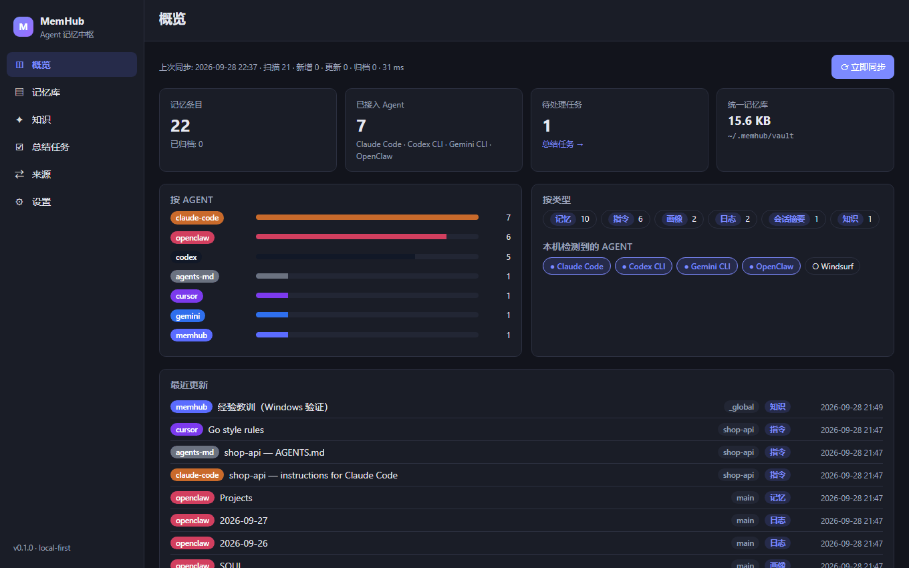
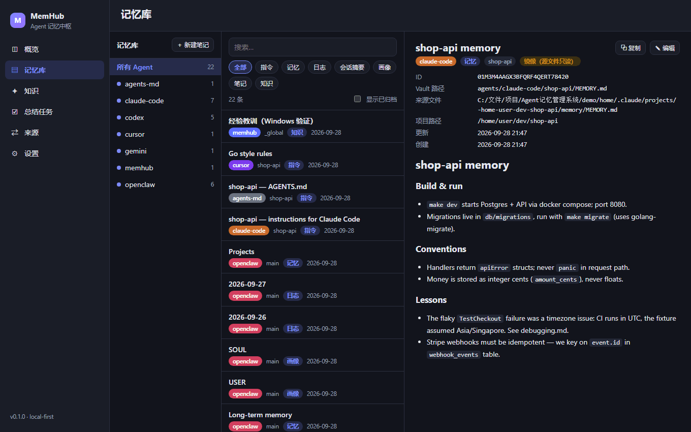
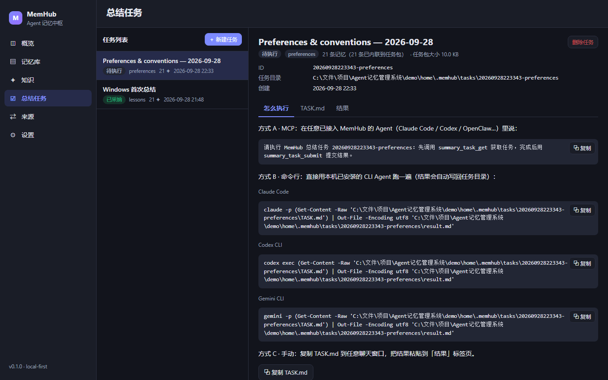
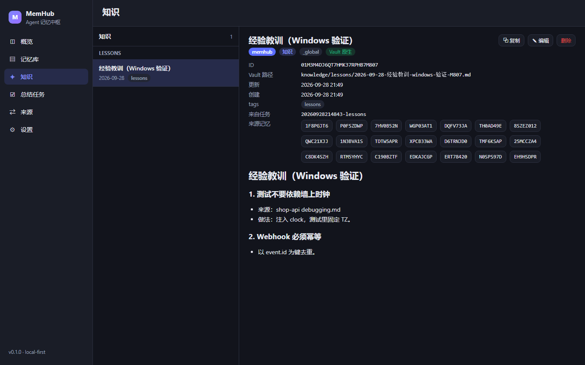
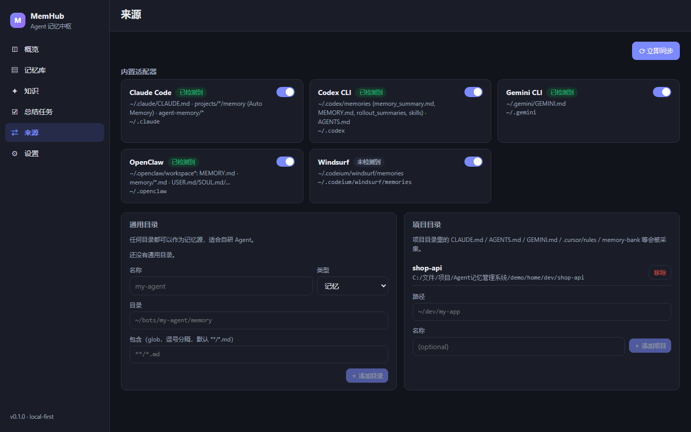
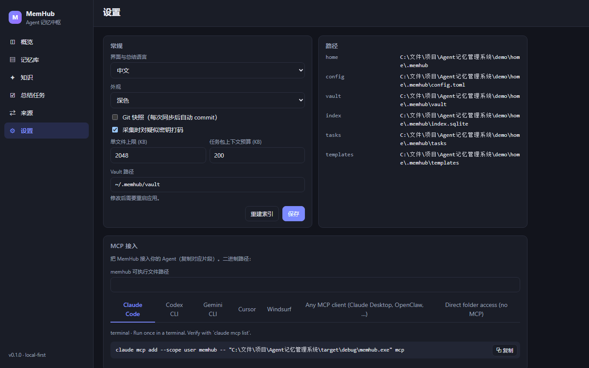
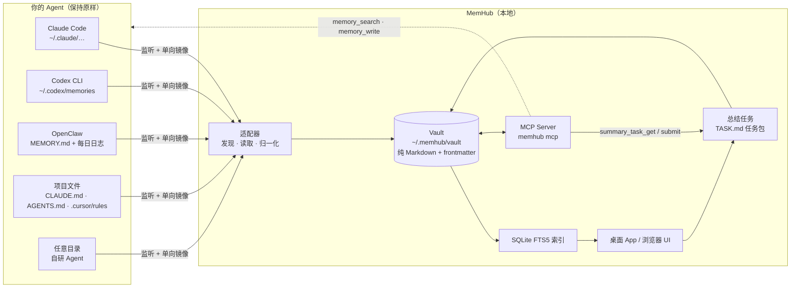

<p align="center">
  
</p>

<p align="center">
  <a href="https://github.com/MT-gar/MemHub/actions/workflows/ci.yml"></a>
  <a href="https://github.com/MT-gar/MemHub/releases"></a>
  <a href="LICENSE"></a>
  
  
  
</p>

<p align="center">
  <a href="README.md">English</a> · <b>简体中文</b> · <a href="docs/DESIGN.md">设计文档</a> · <a href="CHANGELOG.md">更新日志</a>
</p>

---

每个 AI 编程 Agent 都有自己的小本本：Claude Code 写 `CLAUDE.md` 和 Auto Memory，Codex CLI 存在 `~/.codex/memories/`，OpenClaw 有 `MEMORY.md` 加每日日志，Cursor 用 `.cursor/rules`，你自研的 Agent 又是另一套……它们彼此都看不到对方记了什么。

**MemHub** 会自动找到这些文件，**单向镜像到本地一个纯 Markdown 的 Vault**，提供桌面 App 浏览 / 搜索 / 编辑，通过 **MCP** 让每个 Agent 都能读写这份共享记忆，并把「总结一下我的 Agent 都学到了什么」变成一个由**你现有的 Agent** 来执行的任务——不需要 API Key、不内置 LLM、任何数据不出本机。

<p align="center">
  
</p>

## 目录

- [特性](#特性)
- [界面截图](#界面截图)
- [工作原理](#工作原理)
- [支持的 Agent](#支持的-agent)
- [安装](#安装)
- [快速开始](#快速开始)
- [接入 Agent（MCP）](#接入-agentmcp)
- [总结：用你自己的 Agent](#总结用你自己的-agent)
- [Vault 结构](#vault-结构)
- [CLI 与配置](#cli-与配置)
- [隐私与安全](#隐私与安全)
- [开发](#开发)
- [路线图](#路线图)
- [许可证](#许可证)

## 特性

| | |
|---|---|
| 🔍 **自动发现 + 单向镜像** | 检测本机安装了哪些 Agent，按内容哈希增量镜像其记忆文件；源文件删除后自动归档；可选 git 快照保留历史。**从不改写源文件**。 |
| 🧩 **内置适配器** | Claude Code、Codex CLI、Gemini CLI、OpenClaw、Windsurf，项目级文件（`CLAUDE.md`、`AGENTS.md`、`GEMINI.md`、`.cursor/rules`、Cline `memory-bank/`、Copilot instructions、Kiro steering），以及**任意目录**（自研 Agent）。 |
| 🖥️ **桌面 App（Tauri 2）** | 概览、三栏记忆浏览器 + 全文搜索（SQLite FTS5 trigram 分词，对中文友好）、知识笔记、总结任务、来源、设置。中英双语，浅色 / 深色主题。 |
| 🔌 **MCP Server** | `memhub mcp` 提供 `memory_search` / `memory_read` / `memory_list` / `memory_write` / `knowledge_save` / `rules_get` / `rule_propose` / `summary_task_get` / `summary_task_submit`，让 Agent 之间共享同一份记忆。 |
| 🧠 **BYOA 总结** | 选范围 + 模板（经验教训 · 偏好规范 · 项目卡片 · 去重冲突 · 周期摘要）→ 生成任务包 → 用 MCP、一行命令或复制粘贴执行 → 预览 → 采纳为带来源回溯的知识笔记。 |
| 🔒 **默认隐私** | 100 % 本地。镜像时对疑似密钥打码；Vault 目录以 `0700` 创建；没有任何遥测。 |
| 🌐 **浏览器模式** | `memhub serve` 通过 HTTP 提供同一套 UI，服务器 / NAS / 无桌面环境也能用。 |

## 界面截图

<table>
  <tr>
    <td width="50%"><p align="center"><sub><b>记忆</b> — 左侧按 Agent 分组，中间全文搜索，右侧渲染 Markdown</sub></p></td>
    <td width="50%"><p align="center"><sub><b>总结任务</b> — 用你现有的 Agent，三种方式执行任务</sub></p></td>
  </tr>
  <tr>
    <td><p align="center"><sub><b>知识</b> — 采纳后的总结，可回溯到来源记忆</sub></p></td>
    <td><p align="center"><sub><b>来源</b> — 内置适配器、通用目录与项目目录</sub></p></td>
  </tr>
  <tr>
    <td><p align="center"><sub><b>设置</b> — 每个 Agent 的 MCP 接入片段，一键复制</sub></p></td>
    <td><p align="center"><sub><b>浅色主题</b> — 跟随系统或手动切换（英文界面示例）</sub></p></td>
  </tr>
</table>

## 工作原理



1. **镜像** — 适配器读取各 Agent 的文件，每条记忆写成 Vault 里的一个 Markdown 文件，附一小段 YAML frontmatter（`id`、`agent`、`source`、`origin`、`project`、`kind`、`title`、`created`、`updated`、`origin_hash`、`tags`……）。文件监听保持镜像新鲜，另有周期性全量同步兜底。
2. **索引** — 全部进入本地 SQLite FTS5 索引（trigram 分词，中文和代码标识符都能搜）。索引只是缓存，随时可删除重建。
3. **共享** — `memhub mcp` 让任何支持 MCP 的 Agent 都能搜索 / 读取 / 写入 Vault；不支持 MCP 的 Agent 直接读目录即可。
4. **沉淀** — 你新建一个*总结任务*，MemHub 把选中的记忆内联进 `TASK.md`，由**你的** Agent 产出总结，你预览后采纳为知识笔记。

## 支持的 Agent

| Agent | 收集内容 | 位置 |
|---|---|---|
| **Claude Code** | 全局 / 项目 `CLAUDE.md`、Auto Memory（`MEMORY.md` + 主题文件）、子 Agent 记忆；项目路径从会话记录的 `cwd` 中还原 | `~/.claude/…`、`<仓库>/.claude/…` |
| **Codex CLI** | `memory_summary.md`、`MEMORY.md`、rollout summaries、skills、`AGENTS.md` | `~/.codex/memories/`、`~/.codex/AGENTS.md` |
| **Gemini CLI** | 全局 / 项目 `GEMINI.md` | `~/.gemini/`、`<仓库>/GEMINI.md` |
| **OpenClaw** | `MEMORY.md`、每日日志 `memory/YYYY-MM-DD.md`、常青笔记、`SOUL.md` / `USER.md` 等画像文件——所有 workspace | `~/.openclaw/workspace*/` |
| **Windsurf** | Cascade memories | `~/.codeium/windsurf/memories/` |
| **项目文件** | `AGENTS.md`、`.cursorrules` / `.cursor/rules/*.mdc`、Cline `memory-bank/*.md`、`.github/copilot-instructions.md`、`.windsurfrules`、`.kiro/steering/*.md` | 你登记的任意项目目录 |
| **通用目录** | 匹配你指定 glob 的任意 Markdown / 文本文件 | 任意路径——自研 Agent 首选 |
| **原生笔记** | Agent 通过 MCP（`memory_write`）或你在 App 里写入 | `vault/inbox/` |

没有你用的 Agent？一个适配器大约 100 行 Rust，见 [CONTRIBUTING.md](CONTRIBUTING.md)。

## 安装

**桌面 App** — 到 [Releases](https://github.com/MT-gar/MemHub/releases) 下载最新安装包：`.msi` / `-setup.exe`（Windows）、`.dmg`（macOS）、`.AppImage` / `.deb` / `.rpm`（Linux）。CLI 作为 sidecar 已内置在 App 中。

> macOS 版本暂未签名公证：首次打开请右键 → 打开。

**独立 CLI** — 同一 Release 页面的 `memhub-cli-<target>.zip|tar.gz`，把 `memhub` 放进 `PATH` 即可。

**从源码构建**（Rust stable、Node 20+）：

```bash
git clone https://github.com/MT-gar/MemHub.git && cd MemHub

# CLI + 浏览器模式
npm ci --prefix ui && npm run build --prefix ui
cargo build --release -p memhub-cli
./target/release/memhub serve            # → http://127.0.0.1:7337

# 桌面版（需要 Tauri 环境：https://tauri.app/start/prerequisites/）
./scripts/build-sidecar.sh               # 把 CLI 打进 sidecar
npm ci --prefix apps/desktop && npm run build --prefix apps/desktop
# → apps/desktop/src-tauri/target/release/bundle/
```

> **Windows**：请使用 MSVC 工具链（`rustup default stable-msvc`，或在仓库目录执行 `rustup override set stable-x86_64-pc-windows-msvc`）。GNU 工具链缺少 MinGW 的 `dlltool` 时会在编译 `windows-sys` 时失败。`scripts/*.sh` 在 Git Bash 中可直接运行。完整的 Windows 实机过程见 [docs/mcp-memhub-bootstrap.md](docs/mcp-memhub-bootstrap.md)。

## 快速开始

```bash
memhub detect        # 本机装了哪些 Agent（只读）
memhub scan          # 第一次镜像到 ~/.memhub/vault
memhub serve         # 打开 http://127.0.0.1:7337 —— 或者直接启动桌面 App
```

桌面 App 启动时会做同样的事，并在后台持续监听。在 **来源** 页启用 / 禁用适配器、添加通用目录或登记项目目录；**概览** 页显示找到了什么。

想先体验又不想碰真实数据？`./scripts/demo.sh` 会生成一个包含多个 Agent 记忆的假主目录：

```bash
./scripts/demo.sh
export MEMHUB_USER_HOME="$PWD/demo/home" MEMHUB_HOME="$PWD/demo/home/.memhub"
memhub serve
```

## 接入 Agent（MCP）

**设置 → MCP 接入** 页会为每个 Agent 生成带正确可执行文件路径、可直接复制的片段。要点：

```bash
claude mcp add --scope user memhub -- memhub mcp        # Claude Code
codex mcp add memhub -- memhub mcp                      # Codex CLI
gemini mcp add memhub memhub mcp                        # Gemini CLI
```

其他 MCP 客户端（Cursor、Windsurf、Claude Desktop、OpenClaw……）：

```json
{ "mcpServers": { "memhub": { "command": "memhub", "args": ["mcp"] } } }
```

| 工具 | 用途 |
|---|---|
| `memory_search(query, limit?, agent?, project?, kind?)` | 跨所有 Agent 的记忆、共享笔记和知识做全文搜索 |
| `memory_read(id)` | 读取一条记忆的完整内容 |
| `memory_list(agent?, project?, kind?, since?, limit?)` | 按条件列出最近的条目 |
| `memory_write(title, content, tags?, project?, agent?)` | 把笔记写入 `vault/inbox`，供其他 Agent 查找 |
| `knowledge_save(title, content, tags?, sources?)` | 保存一条沉淀后的知识笔记 |
| `rules_get(project?, format?, max_lines?)` | 读取用户**已批准**的规则（全局 + 该项目）为紧凑 Markdown |
| `rule_propose(text, rationale?, project?, sources?)` | 提议一条规则；只存为**草稿**，用户批准前不生效 |
| `summary_task_get(task_id?)` | 获取总结任务（完整提示词 + 记忆内容） |
| `summary_task_submit(task_id, result)` | 提交总结结果，回到 App 中审阅 |

不支持 MCP 的 Agent 可以直接读 Vault：把设置页的「直接访问目录」片段贴进它的 `AGENTS.md` / `CLAUDE.md`。

## 总结：用你自己的 Agent

MemHub 刻意**不内置 LLM、不需要 API Key**，而是把活儿准备好，交给你已经在用（已经在付费）的 Agent 去做：

1. **总结任务 → 新建**：选模板和范围（Agent、项目、类型、关键词、时间段）。MemHub 生成 `~/.memhub/tasks/<id>/TASK.md`，把指令和选中的记忆内联进去（超出上下文预算的只列 id，Agent 可用 `memory_read` 自取）。
2. **执行**，用你顺手的 Agent：
   - *MCP*：在任一接入了 MCP 的 Agent 里说「执行 MemHub 总结任务 `<id>`」→ 它会调用 `summary_task_get` … `summary_task_submit`；
   - *命令行*：`claude -p "$(cat TASK.md)" > result.md`（`codex exec …` / `gemini -p …` 同理；Windows 下 App 会给出对应的 PowerShell 命令）；
   - *手动*：把 `TASK.md` 贴进任意聊天窗口，再把回答贴回 **结果** 页签。
3. **预览 → 采纳**：结果保存为 `vault/knowledge/<模板>/<日期>-<标题>.md`，frontmatter 里的 `sources: [ids]` 可回溯来源，并重建 `knowledge/INDEX.md`。Agent 可以走 MCP 读，也可以直接读文件。

内置模板（`~/.memhub/templates/` 下的 Markdown，可自行修改）：

| 模板 | 产出 |
|---|---|
| `lessons` 经验教训 | 从调试记录、踩坑和成功做法中提炼可复用的经验 |
| `preferences` 偏好规范 | 你在所有 Agent 中表现出的稳定偏好、编码规范和禁忌 |
| `project-brief` 项目卡片 | 每个项目一张知识卡：架构、决策、约定、常用命令、待办 |
| `dedupe` 去重冲突 | 找出跨 Agent 重复、过时或互相矛盾的记忆并给出合并建议 |
| `rules` 规则草稿 | 提炼成一句话规则；采纳后每条成为**草稿规则**（见下节） |
| `digest` 周期摘要 | 一段时间内各 Agent 做了什么、学到什么、还有什么没做完 |

## 规则：回到 Agent 的那条路

记忆从各个 Agent 流进 MemHub；**规则**则是把少量经你审核的偏好送回去的方式——而且 MemHub 从不改动任何 Agent 自己的文件。一条规则就是一句短话（「用简体中文回答」「用 pnpm，不用 npm」），范围是*全局*（个人偏好）或某个*项目*。

- **生命周期：** `草稿` → `已批准` → `已退役`。只有**已批准**的规则才会被提供；没有任何自动批准。草稿来自 Agent（`rule_propose`）、被采纳的 `rules` 总结任务，或你自己（**规则**页 / `memhub rules add`）。你在 App 里手动输入的规则会直接批准（你自己就是审核人），勾选「先存为草稿」则留待审核。
- **拉取而不是推送：** Agent 在会话开始时自己来取——MCP 的 `rules_get`，或 `memhub context`（输出 Markdown；没有已批准规则时什么都不输出，方便放进 hook）。在你已经在用的 `AGENTS.md` / `CLAUDE.md` / `GEMINI.md` 里加一行即可（只需一次）：*「每次会话开始时，调用 MemHub MCP 工具 `rules_get`（或运行 `memhub context`）并遵守其中的规则。」* 之后批准或退役规则，对所有 Agent 立即生效，无需再改文件。
- **项目规则：** `memhub context` 默认用当前目录（`--project 路径|名称` 指定，`--global` 只要全局）。路径会先对照你登记的项目目录，否则取所在的 git 仓库。
- **篇幅预算：** 默认最多 40 条 / 4 KiB，全局规则优先；输出会说明省略了几条。
- **护栏：** MCP 只能*提议*。规则限一行（≤ 300 字符）；疑似密钥、含隐藏/双向控制字符的会被拒绝；自动去重；含 shell 命令、URL 或「忽略之前的指令」之类内容的会标出风险提示；待审草稿最多 50 条；规则不会被再喂给总结任务。`memhub rules approve` 在没有交互终端时拒绝执行，除非加 `--yes`，避免在 shell 里跑命令的 Agent 无意中批准自己的提议——但要注意，任何能写 Vault 目录的进程仍然可以直接改文件，这和任何本地工具一样。

```
memhub rules list [--status draft|approved|retired] [--scope global|project:名称]
memhub rules add "用 pnpm，不用 npm" [--scope project:名称] [--detail 理由] [--approve]
memhub rules approve|retire|draft|rm <id>      # id：list 里显示的 6 位后缀
memhub context [--project 路径|名称] [--global] [--format md|json] [--max-lines N] [--with-ids]
```

## Vault 结构

```
~/.memhub/                       （可用 MEMHUB_HOME 整体搬家）
├── config.toml                  来源、项目、选项
├── index.sqlite                 全文索引缓存（可随时删除重建）
├── templates/                   总结模板（可编辑的 Markdown）
├── tasks/<id>/                  TASK.md · task.json · result.md
└── vault/                       ★ 统一记忆目录（有 git 时自动 git init）
    ├── agents/<agent>/<project>/…   只读镜像
    ├── inbox/<agent>/…              通过 MCP / App 写入的笔记
    ├── knowledge/<模板>/…            采纳的总结 + INDEX.md
    └── rules/global|project-<名称>/…  经审核的规则（状态在 frontmatter 里）
```

每个条目都是 Markdown + 一小段 YAML frontmatter，所以就算不用 MemHub，这个目录用任何编辑器、Obsidian、`grep` 或 git 都照样好使。

## CLI 与配置

```
memhub scan                       镜像一次
memhub watch                      镜像后持续监听
memhub mcp [--agent NAME]         stdio MCP Server
memhub serve [--host H] [--port 7337] [--no-watch] [--allow-origin O] [--token T]
                                  Web UI + HTTP API（POST /api/<command>）
memhub detect | list | search <q> | show <id> | paths | reindex
memhub context [--project P] [--global] [--format md|json]   给 Agent 的已批准规则
memhub rules list | add | approve | retire | draft | rm        审核规则
memhub --home <dir> …             使用另一个 MemHub 主目录
```

`~/.memhub/config.toml`：

```toml
vault = "~/.memhub/vault"
language = "zh-CN"               # 界面与总结语言（"zh-CN" | "en"）
git_snapshot = false             # 每次同步后提交 Vault
max_file_size_kb = 2048
redact_secrets = true
task_context_budget_kb = 200

[[sources]]
type = "claude-code"             # claude-code | codex | gemini | openclaw | windsurf | generic
enabled = true

[[sources]]
type = "generic"                 # 任意目录——比如你自研的 Agent
name = "my-agent"
root = "~/my-agent/memory"
include = ["**/*.md"]
kind = "memory"

[[projects]]
path = "~/dev/shop-api"          # 其中的 CLAUDE.md / AGENTS.md / .cursor/rules / memory-bank …
name = "shop-api"
```

环境变量：`MEMHUB_HOME` 整体搬家；`MEMHUB_USER_HOME` 改变适配器扫描的用户主目录（默认为系统主目录；注意 Windows 下 `HOME` 会被忽略）。

## 隐私与安全

- **纯本地。** 没有遥测、没有内置模型。浏览器模式默认只监听 `127.0.0.1`，并拒绝来自其他网站的请求（校验 Host / Origin / Content-Type，跨站提交与 DNS 重绑定都无法操控它）。
- **对外开放需要显式开启，且必须带令牌。** 使用 `--host 0.0.0.0`（或任何非本机地址，或 `--token`）时，MemHub 会生成访问令牌并打印 `…/?token=…` 链接；没有令牌时除 `/api/health` 外一律返回 401。网络不可信时请在前面加带 TLS 的反向代理。
- **对 Agent 只读。** MemHub 从不修改源文件；你在 App 里对镜像条目的修改会在源文件下次变化时被覆盖（App 会提示）。
- **密钥打码**：镜像时把形似 API Key 的字符串（`sk-…`、`ghp_…`、`AKIA…`、私钥块、`password=…` 等）替换为 `[REDACTED]`。这是尽力而为——把任务包发给云端模型前请先过目。
- **数据去哪由你决定**：总结内容只会发给*你自己*选择运行的那个 Agent。

漏洞报告方式见 [SECURITY.md](SECURITY.md)。

## 开发

```
crates/memhub-core   Rust 核心库：适配器、Vault、索引、任务、MCP、监听、API 分发
crates/memhub-cli    `memhub` 可执行文件（同时是桌面版 sidecar）
ui/                  React + Vite 前端，桌面版与浏览器模式共用
apps/desktop         Tauri 2 壳（很薄：一个 `rpc` 命令 → core）
docs/                设计文档、Windows 实机记录、截图
scripts/             演示数据、开发循环、sidecar 构建
```

```bash
./scripts/demo.sh                 # 生成含多个 Agent 记忆的假主目录
./scripts/dev.sh                  # API :7337（演示数据）+ Vite 热更新 :1420
cargo test --workspace
npm run dev --prefix apps/desktop # 带热更新的桌面窗口
```

CI 在 Ubuntu、Windows 和 macOS 上构建、测试，并对 Tauri 壳做 `cargo check`；打 `v*` 标签会为 Windows、macOS（arm64 + x64）、Linux 构建桌面安装包和独立 CLI 压缩包，并附到一个草稿 GitHub Release 上。欢迎贡献——见 [CONTRIBUTING.md](CONTRIBUTING.md)。

## 路线图

- 可选的写回：把已批准的规则带 diff 预览、可回滚地写进 Agent 文件（`AGENTS.md` 等），并提供「doctor」检查各 Agent 是否真的看到了规则（见 [docs/mcp-next-steps.md](docs/mcp-next-steps.md)）
- Codex 存在 SQLite 里的记忆（`memories_1.sqlite`，较新版本的 Codex）
- 会话记录摘要（Claude Code / Codex 的 `.jsonl` → 每次会话一份回顾）
- 带 diff 预览的写回（Vault → Agent 文件，需手动开启）
- 跨 Agent 的去重 / 冲突视图
- 更多适配器（Cline 全局记忆、Aider、Continue、Roo Code……）
- 桌面版自动更新

细节与 M0 状态表见 [docs/DESIGN.md](docs/DESIGN.md)。

## 许可证

[MIT](LICENSE) © 2026 MT-gar and MemHub contributors
